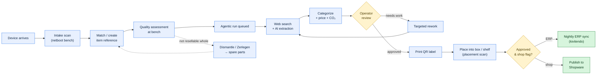

# WMS Capability Landscape

> **Draft for extension.** This is a starting map of what the mediator-service (WMS) can
> do today, meant as scaffolding for a full **process landscape** of the whole operation.
> The mediator-service is one important part — add the surrounding processes (logistics,
> reception/goods-in, sales, accounting, dismantling workshop, etc.) around it.
>
> Diagrams are [Mermaid](https://mermaid.js.org/) — they render directly in Gitea/GitHub
> and VS Code (Markdown Preview Mermaid extension). Edit the text below to extend them.
> Legend: **solid boxes = capabilities the WMS has today**, dashed = planned/partial,
> cylinders/hexagons = external systems the WMS talks to.

---

## 1. Capability map — what the WMS does today

Grouped by domain. Each domain maps to a folder README + a topic changelog in the repo.

Laid out as three horizontal bands so it stays compact: **capture → create value →
integrate**. Each inner box is a capability the WMS has today.

```mermaid
flowchart TB
    classDef core fill:#1f6feb,stroke:#0d3b8a,color:#fff;
    classDef domain fill:#e8f0fe,stroke:#1f6feb,color:#0d2440;
    classDef planned fill:#fff8e1,stroke:#c79100,color:#4a3b00,stroke-dasharray:4 3;
    classDef ext fill:#f0f0f0,stroke:#777,color:#222;
    classDef band fill:#fafbff,stroke:#c9d6f0,color:#0d2440;

    WMS(["Mediator-Service · WMS core"]):::core

    subgraph BAND1["① Capture — get the device into the system"]
        direction LR
        subgraph INTAKE["🖥️ Device Intake"]
            direction TB
            I1["Netboot scan station<br/>(hardware auto-detect)"]:::domain
            I2["Cataloguing<br/>+ reference matching"]:::domain
            I3["Quality questionnaire<br/>at bench"]:::domain
        end
        subgraph SCAN["📷 Scanning & QR"]
            direction TB
            Q1["QR label generation"]:::domain
            Q2["Scan-to-navigate<br/>(item / box)"]:::domain
            Q3["Scanner workflows<br/>+ scan audit"]:::domain
        end
        subgraph STORAGE["🗄️ Storage & Placement"]
            direction TB
            S1["Boxes & shelves"]:::domain
            S2["Locations & relocation"]:::domain
            S3["Placement scan into box"]:::domain
            S4["Box stubs"]:::domain
            S5["Transport boxes"]:::planned
            S6["Inventory cycle"]:::planned
        end
    end

    subgraph BAND2["② Create value — describe, enrich, assess"]
        direction LR
        subgraph LIFECYCLE["📦 Item Lifecycle"]
            direction TB
            L1["Item CRUD<br/>(refs + instances)"]:::domain
            L2["Quality assessment<br/>+ derived specs"]:::domain
            L3["Accessories / Zubehör"]:::domain
            L4["Spare parts / Ersatzteile"]:::domain
            L5["Dismantling / Zerlegen"]:::domain
            L6["CO₂ recovery scoring"]:::domain
        end
        subgraph AGENTIC["🤖 Agentic AI Enrichment"]
            direction TB
            A1["Web search<br/>(evidence gathering)"]:::domain
            A2["Extract → categorize → price"]:::domain
            A3["Operator review<br/>& approval gate"]:::domain
            A4["Targeted rework<br/>+ run history/snapshots"]:::domain
            A5["Dispatch queue<br/>(concurrency-capped)"]:::domain
        end
        subgraph MEDIA["🖼️ Media & Files"]
            direction TB
            M1["Photos"]:::domain
            M2["Attachments<br/>(instance + product)"]:::domain
            M3["External docs<br/>(wipe reports, scans)"]:::domain
        end
    end

    subgraph BAND3["③ Integrate — get it out to sales & systems"]
        direction LR
        subgraph PRINT["🖨️ Printing"]
            direction TB
            P1["Item / box labels"]:::domain
            P2["A4 marketing sheets"]:::domain
            P3["CUPS queues + drivers"]:::domain
        end
        subgraph ERP["🔄 ERP & Shop Sync"]
            direction TB
            E1["CSV import / export"]:::domain
            E2["Langtext generation"]:::domain
            E3["Nightly ERP sync<br/>(approval-gated)"]:::domain
            E4["Shop publishing"]:::domain
            E5["Backup / restore"]:::domain
        end
        subgraph ADMIN["⚙️ Admin & Platform"]
            direction TB
            D1["Admin console<br/>(config, queues)"]:::domain
            D2["Event log / audit"]:::domain
            D3["Auth (Authentik / secret)"]:::planned
            D4["Deploy pipeline (CD)"]:::domain
        end
    end

    %% Chain the bands so they stack vertically (① → ② → ③), not side by side
    WMS --- BAND1
    BAND1 ~~~ BAND2
    BAND2 ~~~ BAND3

    class BAND1,BAND2,BAND3 band;

    %% External systems the WMS integrates with
    NETBOOT[["Netboot image (bench PXE)"]]:::ext
    TAVILY[("Tavily web search")]:::ext
    OLLAMA[("Ollama LLM")]:::ext
    KIVITENDO[("kivitendo ERP")]:::ext
    SHOPWARE[("Shopware shop")]:::ext
    CUPS[["CUPS printers"]]:::ext
    WEBDAV[("WebDAV storage")]:::ext
    PG[("PostgreSQL")]:::ext

    INTAKE -.-> NETBOOT
    AGENTIC -.-> TAVILY
    AGENTIC -.-> OLLAMA
    ERP -.-> KIVITENDO
    ERP -.-> SHOPWARE
    PRINT -.-> CUPS
    MEDIA -.-> WEBDAV
    WMS -.-> PG
```



---

## 2. End-to-end process flow — a device's journey

The dominant happy path, from a donated/returned device to a sellable, synced item.
This is the spine to hang the wider process landscape on.



---

## 3. How to extend this (notes for the intern)

- **Add the surrounding processes.** The WMS covers cataloguing → enrichment → storage →
  sync. A full landscape also needs: goods-in/reception, the dismantling workshop, sales
  channels beyond Shopware, returns, disposal/recycling, and accounting. Draw those as
  sibling lanes around the WMS core in diagram 1.
- **Mark ownership.** Colour or annotate each box with *who* runs it (system-automatic,
  operator, external partner) — a process landscape is about responsibility, not just data.
- **Planned vs. live.** Dashed yellow = not built yet (transport boxes, inventory cycle,
  full auth). Check `todo.md` for current status before promoting one to solid.
- **Source of truth per domain.** Each capability box has a folder `README.md` and a topic
  changelog under `docs/changelogs/` — see the domain table in `OVERVIEW.md`. Read those
  before detailing a box.
- **Prefer editing this Mermaid over a binary.** It diffs cleanly in git. If a richer visual
  is needed later, the empty `docs/overview.drawio` is reserved for a draw.io version.
```
